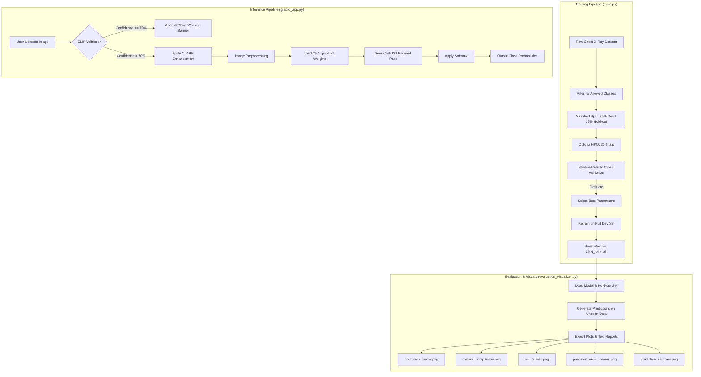
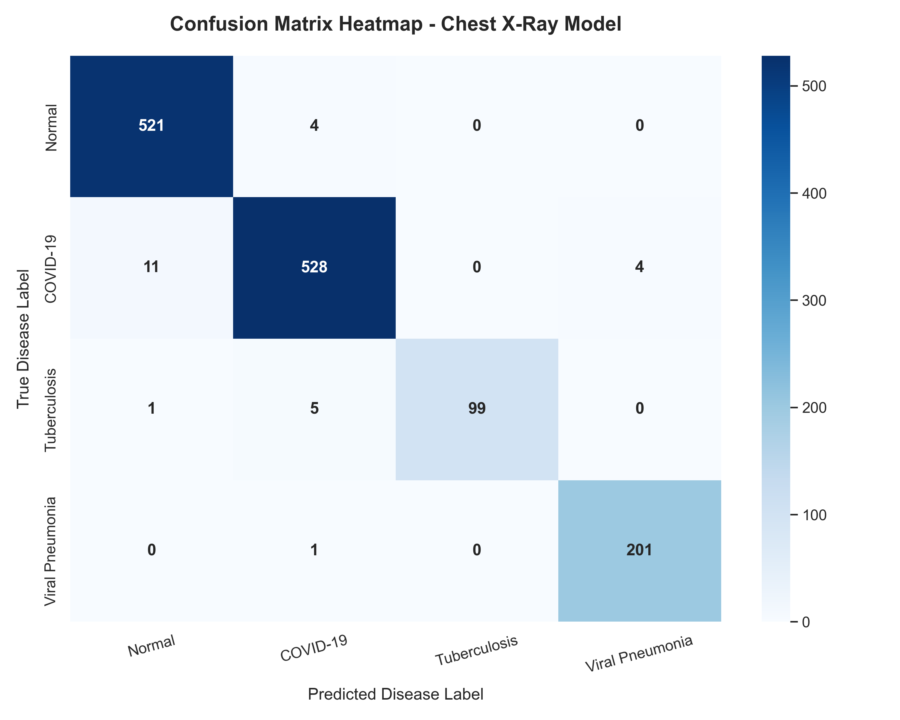
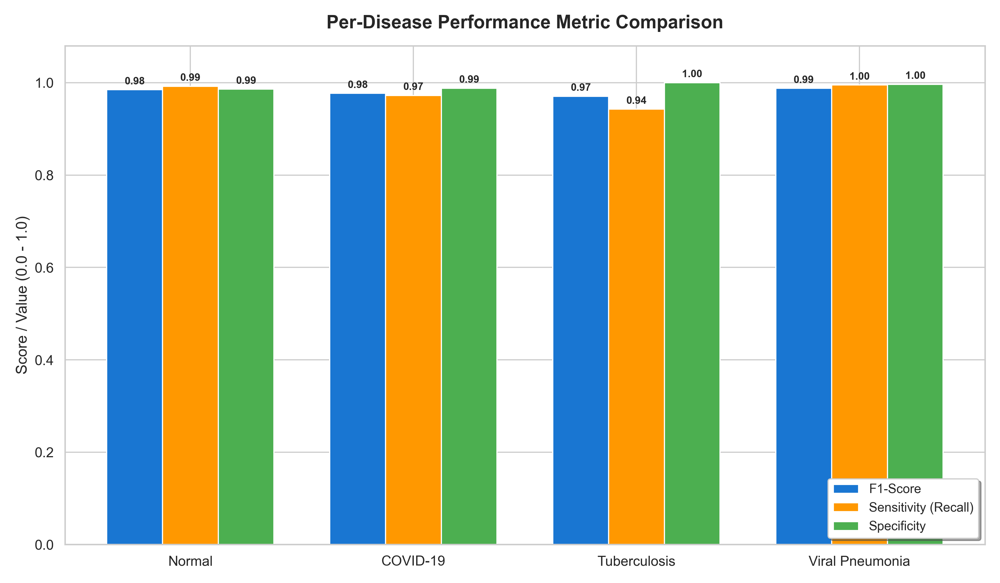
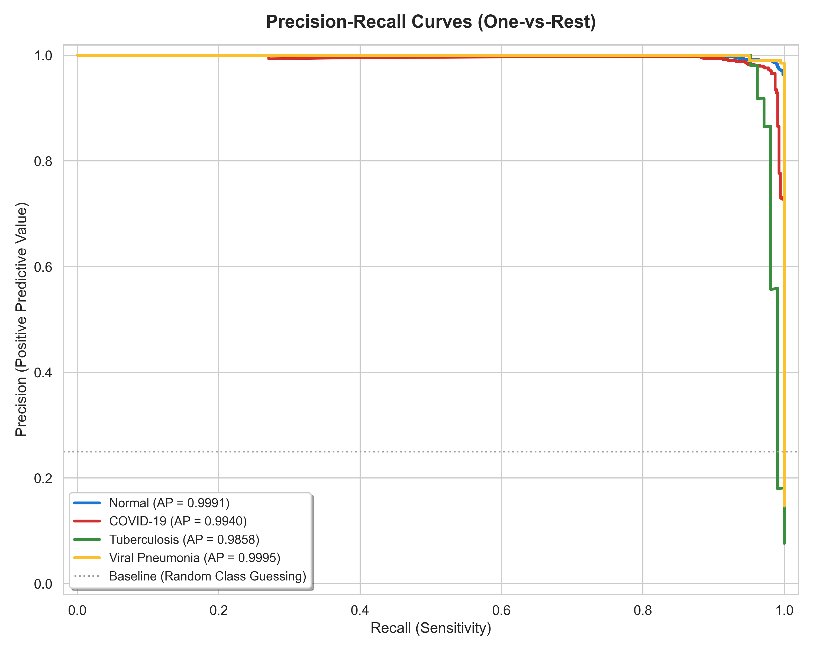
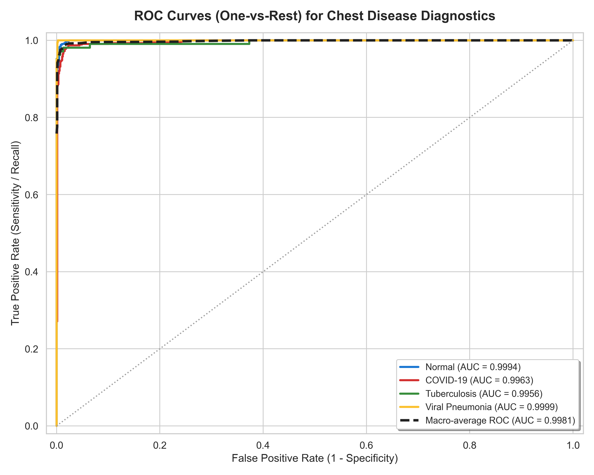
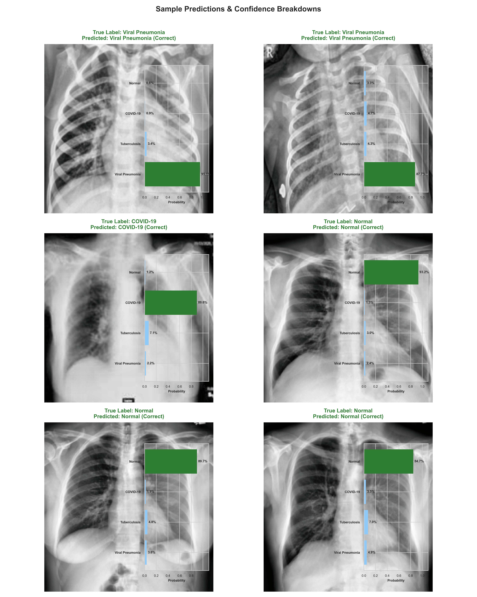

# Pulmonary Diagnostics AI 🫁
### *Automated screening & multi-class classification of pulmonary diseases from chest radiographs using fine-tuned DenseNet-121 and Optuna optimization.*

[](https://www.python.org/)
[](https://pytorch.org/)
[](https://optuna.org/)
[](https://gradio.app/)
[](https://huggingface.co/spaces/NashidulSarker/pulmonary-diagnostics-ai)
[](https://opensource.org/licenses/MIT)

---

## 1. Project Overview

**Pulmonary Diagnostics AI** is a state-of-the-art diagnostic screening tool designed to classify chest X-ray (radiograph) scans into four distinct categories:
1. **Normal** (healthy lungs)
2. **COVID-19**
3. **Tuberculosis (TB)**
4. **Viral Pneumonia**

### Clinical & Technical Significance
Chest radiographs are a primary diagnostic imaging modality worldwide. However, interpreting chest X-rays requires specialized radiological expertise, which is often a bottleneck in resource-limited healthcare environments. In critical diseases like COVID-19, Tuberculosis, and Viral Pneumonia, prompt diagnosis is essential for clinical triage, containment, and treatment. 

This project addresses these challenges by providing:
* **High-Accuracy Triage Support:** Achieving **98% overall classification accuracy** on a blind hold-out dataset.
* **Objective Diagnostic Screening:** Providing class probabilities and confidence scores to mitigate inter-observer variability.
* **Integrated Safety Mechanisms:** Utilizing a zero-shot model (OpenAI CLIP) to validate that incoming inputs are indeed medical chest radiographs, preventing out-of-distribution (OOD) errors or misuse.
* **Low-Latency Deployment:** Pre-configured for cloud execution and interactive clinical demos.

---

## 2. Features

* **Image Preprocessing & Detail Enhancement:**
  * **CLAHE (Contrast Limited Adaptive Histogram Equalization):** Custom OpenCV transform applied during both training and inference to enhance subtle features in lung fields and tissue boundaries.
  * **Torchvision v2 Preprocessing:** Robust resizing, center-cropping, tensor conversion, and ImageNet standardization.
* **Robust Dataset Handling:**
  * Custom filtering of `datasets.ImageFolder` to isolate target classes.
  * **Stratified Train-Test Splitting:** Retains a clean 15% blind hold-out set, utilizing 85% for cross-validation.
* **Automated Hyperparameter Tuning:**
  * Integrated **Optuna Study** running 20 trials with a **MedianPruner** to prune sub-optimal runs early.
  * Automated optimization of head/backbone learning rates, weight decay, dropout, optimizer type, and scheduler configuration.
* **Advanced Model Training & Fine-Tuning:**
  * **DenseNet-121 Backbone:** Feature extractor leveraging pre-trained ImageNet weights.
  * **Dynamic Layer Unfreezing:** Progressively unfreezes `denseblock4` of the backbone halfway through training (at epoch 4/5) to adapt high-level convolutional features.
  * **Class Imbalance Mitigation:** Computes dynamic class weights passed to `CrossEntropyLoss`.
  * **Label Smoothing:** Uses 0.1 label smoothing to prevent overfitting and model overconfidence.
* **Comprehensive Evaluation Pipeline:**
  * Stratified 3-Fold Cross-Validation.
  * Automated computation of Accuracy, Macro-Average Sensitivity, Specificity, F1-score, AUC-ROC, and AUC-PR (Average Precision).
* **Visualization Suite (`evaluation_visualizer.py`):**
  * Confusion Matrix Heatmap.
  * Multi-class One-vs-Rest (OvR) ROC Curves.
  * Multi-class Precision-Recall Curves.
  * Per-disease performance comparison bar charts.
  * Random sample prediction layouts featuring image inputs, labels, and horizontal confidence bar plots.
* **Interactive UI & Deployment:**
  * Gradio web application with a responsive dark-themed interface, device acceleration detection (CUDA/XPU/CPU), and caution banners.
  * Hugging Face Spaces integration.

---

## 3. Model Architecture

The system utilizes a custom transfer learning strategy on top of **DenseNet-121**. DenseNet architectures are exceptionally well-suited for medical imaging due to dense blocks, where each layer receives direct inputs from all preceding layers. This encourages feature propagation, mitigates vanishing gradients, and drastically reduces the parameter count compared to standard residual architectures.

```
       Input Chest X-Ray (224x224x3)
                    │
                    ▼
     [ DenseNet-121 Feature Extractor ]
  (Pretrained on ImageNet; Layers frozen)
                    │
   (Unfreezes denseblock4 at epoch 4/5)
                    │
                    ▼
          [ Global Avg Pooling ]
                    │
                    ▼
       [ Dropout Layer (rate: 0.2) ]
                    │
                    ▼
    [ Fully Connected (Linear) Layer ]
                    │
                    ▼
        Output Logits (4 Classes)
```

### Preprocessing & Data Augmentation Pipelines
* **Training Pipeline:**
  1. `v2.Resize(256)`
  2. `CLAHE(clip_limit=2.0, tile_grid_size=(8,8))` (Enhances local chest X-ray contrast)
  3. `v2.RandomCrop(224)`
  4. `v2.RandomHorizontalFlip(p=0.5)`
  5. `v2.RandomAffine(degrees=0, translate=(0.05, 0.05), scale=(0.95, 1.05))`
  6. `v2.RandomRotation(degrees=10)`
  7. `v2.ColorJitter(brightness=0.2, contrast=0.2)`
  8. `ToImage()` & `ToDtype(torch.float32, scale=True)`
  9. `v2.Normalize(mean=[0.485, 0.456, 0.406], std=[0.229, 0.224, 0.225])`
* **Validation / Inference Pipeline:**
  1. `v2.Resize(256)`
  2. `CLAHE(clip_limit=2.0, tile_grid_size=(8,8))`
  3. `v2.CenterCrop(224)`
  4. `ToImage()` & `ToDtype(torch.float32, scale=True)`
  5. `v2.Normalize(mean=[0.485, 0.456, 0.406], std=[0.229, 0.224, 0.225])`

### Training, Validation, and Prediction Workflows
* **Training & Optimization Workflow:**
  1. The user launches `main.py`. It initiates an Optuna study.
  2. For each trial, Optuna proposes:
     * Classification head learning rate (`lr_head` between $10^{-4}$ and $10^{-2}$)
     * Backbone learning rate (`lr_backbone` between $10^{-6}$ and $10^{-4}$)
     * Weight decay (between $10^{-5}$ and $10^{-2}$)
     * Dropout rate (between $0.1$ and $0.5$)
     * Optimizer type (`AdamW` or `SGD`)
     * LR scheduler type (`CosineAnnealingLR` or `StepLR`)
  3. The proposed hyperparameters are evaluated via Stratified 3-Fold Cross-Validation on the development set (85% of total dataset).
  4. After 20 trials, the best hyperparameters are saved in `CNN_joint_params.json`.
  5. The model is retrained from scratch on the complete development split using these optimal parameters, unfreezing `denseblock4` starting at epoch 4.
  6. Weights are saved as `CNN_joint.pth`.
* **Validation Workflow:**
  * In cross-validation, models are validated on each validation fold. Metrics are evaluated per epoch. If a new high macro AUC-ROC is achieved, model weights are cached.
* **Prediction/Inference Workflow:**
  1. Image uploaded via the Gradio interface.
  2. Validated via **OpenAI CLIP** (`openai/clip-vit-base-patch32`) to check if the prompt `"a medical chest x-ray scan"` has a score greater than `0.70` compared to `"a non-medical image, photograph, graphic, document, or other body part scan"`. If not, inference is aborted.
  3. Image undergoes custom CLAHE enhancement.
  4. Image resized, center-cropped, and normalized.
  5. Input passed through the trained DenseNet-121 model.
  6. Output logits converted via Softmax to a probability map for all 4 categories.

---

## 4. System Workflow Diagram



---

## 5. Repository Structure

```text
pulmonary-diagnostics-ai/
│
├── Models/
│   ├── CNN_model.py                # DenseNet network definition, CLAHE, transforms, Optuna and K-Fold logic
│   └── evaluation.py               # Evaluation routines (F1, Sensitivity, Specificity, AUC, CM printing)
│
├── Chest_Radiography_Database/     # Local dataset directory
│   ├── COVID-19/                   # Folder with COVID-19 chest radiographs
│   ├── Normal/                     # Folder with Normal chest radiographs
│   ├── Tuberculosis/               # Folder with Tuberculosis chest radiographs
│   └── Viral Pneumonia/            # Folder with Viral Pneumonia chest radiographs
│
├── evaluation_plots/               # Generated graphs and text reports
│   ├── classification_report.txt   # Metrics report on the hold-out dataset
│   ├── confusion_matrix.png        # Confusion Matrix Heatmap
│   ├── metrics_comparison.png      # F1, Sensitivity, Specificity bar chart
│   ├── precision_recall_curves.png # Precision-Recall curves per class
│   ├── prediction_samples.png      # Inset breakdown of 6 random hold-out samples
│   └── roc_curves.png              # ROC Curves per class
│
├── gradio_app.py                   # Main script to run/deploy the UI app
├── main.py                         # Main training, tuning, and retraining orchestration script
├── evaluation_visualizer.py        # Independent script to run evaluation and export visuals
├── requirements.txt                # System dependencies
├── .env                            # Stores environment variables (DATA_DIR)
├── .gitattributes                  # Git attributes file configuration
├── CNN_joint.pth                   # Trained PyTorch Model weights (saved after training)
└── CNN_joint_params.json           # JSON holding optimal parameters found by Optuna
```

---

## 6. Installation

### Clone the Repository
```bash
git clone https://github.com/NashidulSarker/pulmonary-diagnostics-ai.git
cd pulmonary-diagnostics-ai
```

### Create & Activate Virtual Environment
```bash
# Create a virtual environment
python -m venv .venv

# Activate it (Linux/macOS)
source .venv/bin/activate

# Activate it (Windows PowerShell)
.\.venv\Scripts\Activate.ps1
```

### Install Dependencies
```bash
pip install -r requirements.txt
```

---

## 7. Training the Model

### Dataset Requirements & Source
The model was developed using two primary datasets combined:
1. **Tuberculosis & Normal Dataset:** Available on [Kaggle](https://www.kaggle.com/datasets/tawsifurrahman/tuberculosis-tb-chest-xray-dataset).
2. **COVID-19 & Viral Pneumonia Dataset:** Available on [Kaggle](https://www.kaggle.com/datasets/tawsifurrahman/covid19-radiography-database).

The directory structure must match standard PyTorch image loading layouts:
```text
Chest_Radiography_Database/
├── COVID-19/
│   ├── COVID-1.png
│   └── ...
├── Normal/
│   ├── Normal-1.png
│   └── ...
├── Tuberculosis/
│   ├── Tuberculosis-1.png
│   └── ...
└── Viral Pneumonia/
    ├── Viral Pneumonia-1.png
    └── ...
```

### Run Model Training & Hyperparameter Search
Specify your dataset directory in the `.env` file (`DATA_DIR=Chest_Radiography_Database`) or pass it via the command line.

Run the training orchestration script:
```bash
python main.py --data_dir Chest_Radiography_Database
```

* **What happens:**
  1. The script detects accelerators (e.g., Intel XPU, NVIDIA CUDA, or CPU fallback).
  2. Optuna runs 20 search trials over the hyperparameter space.
  3. Best trial parameters are logged and saved to `CNN_joint_params.json`.
  4. The model is retrained on the full development set with the chosen parameters.
  5. The final network is evaluated on the blind hold-out set, print-formatting results to the terminal.
  6. Weights are written to `CNN_joint.pth`.

---

## 8. Running Inference

### Interactive Web App
Launch the Gradio web application locally to run inference via your browser:
```bash
python gradio_app.py
```
After executing, navigate to `http://localhost:7860/`.

### Programmatic Single-Image Inference
Below is a self-contained snippet to programmatically perform inference on a single chest X-ray image using the saved weights and parameters:

```python
import os
import json
import cv2
import torch
import numpy as np
from PIL import Image
from torchvision.transforms import v2
from Models.CNN_model import model_structure, CLAHE

# Setup device
device = torch.device("cuda" if torch.cuda.is_available() else "cpu")

# Load best parameters & build model structure
with open("CNN_joint_params.json", "r") as f:
    best_params = json.load(f)

model = model_structure(device, dropout_rate=best_params["dropout_rate"], num_classes=4)
model.load_state_dict(torch.load("CNN_joint.pth", map_location=device))
model.eval()

# Load image
img_path = "Chest_Radiography_Database/Tuberculosis/Tuberculosis-1.png"
image = Image.open(img_path).convert("RGB")

# Preprocessing Pipeline (same as validation)
preprocess = v2.Compose([
    v2.Resize(256),
    CLAHE(clip_limit=2.0, tile_grid_size=(8,8)),
    v2.CenterCrop(224),
    v2.Compose([v2.ToImage(), v2.ToDtype(torch.float32, scale=True)]),
    v2.Normalize(mean=[0.485, 0.456, 0.406], std=[0.229, 0.224, 0.225])
])

input_tensor = preprocess(image).unsqueeze(0).to(device)

# Forward pass
with torch.no_grad():
    logits = model(input_tensor)
    probabilities = torch.softmax(logits, dim=1)[0].cpu().numpy()

classes = ["Normal", "COVID-19", "Tuberculosis", "Viral Pneumonia"]
predictions = {classes[i]: float(probabilities[i]) for i in range(4)}

print("\nPrediction Probabilities:")
for cls, prob in predictions.items():
    print(f"  {cls}: {prob * 100:.2f}%")
```

---

## 9. Online Demo

An online deployment of this application is publicly accessible at Hugging Face Spaces:

🚀 **[Pulmonary Diagnostics AI - Hugging Face Space](https://huggingface.co/spaces/NashidulSarker/pulmonary-diagnostics-ai)**

### How to use the Demo:
1. **Upload an Image:** Drag and drop a chest X-ray image (PNG or JPEG format) into the input box.
2. **Relevance Validation:** The background CLIP validation will confirm whether the image is a valid chest X-ray scan. If it is not, a warning pops up, and classification is halted.
3. **Analyze Results:** The model computes predictions and shows a real-time status log and horizontal probability bars indicating the diagnostic classification.
4. **Medical Disclaimer:** The interface is equipped with a footer warning stating that the demo is for educational purposes only and should not be used as clinical medical advice.

---

## 10. Evaluation Results

The performance plots are generated by executing:
```bash
python evaluation_visualizer.py
```
This runs evaluations on the 15% blind hold-out dataset (1,375 images) that were never seen by the model during training or cross-validation tuning.

### Classification Report
The classification report showcases the performance across all classes:
```text
                 precision    recall  f1-score   support

         Normal       0.98      0.99      0.98       525
       COVID-19       0.98      0.97      0.98       543
   Tuberculosis       1.00      0.94      0.97       105
Viral Pneumonia       0.98      1.00      0.99       202

       accuracy                           0.98      1375
      macro avg       0.98      0.98      0.98      1375
   weighted avg       0.98      0.98      0.98      1375
```
* **Precision (Positive Predictive Value):** Reflects the likelihood that a positive prediction is correct. The model achieved **100% precision on Tuberculosis** (meaning 0 false positives for TB) and **98%** on other classes.
* **Recall / Sensitivity (True Positive Rate):** Reflects the model's ability to identify all positive cases. The model achieved **100% recall on Viral Pneumonia** and **99% on Normal**, ensuring that healthy patients are rarely diagnosed with a disease and that Viral Pneumonia is not missed.
* **F1-Score:** The harmonic mean of precision and recall. All values are exceptionally high ($0.97 - 0.99$).

---

### Confusion Matrix
The confusion matrix heatmap showcases the exact counts of True vs. Predicted classes on the 1,375 test images:



* **Key Insights:**
  * **COVID-19 vs. Normal:** The primary minor confusion lies between COVID-19 and Normal (11 COVID-19 cases were misclassified as Normal; 10 Normal cases were misclassified as COVID-19).
  * **Tuberculosis:** Out of 105 actual TB cases, 99 were correctly identified. 6 were misclassified (5 as Normal, 1 as COVID-19). There were **no false positives** for Tuberculosis.
  * **Viral Pneumonia:** 202 out of 202 cases were correctly classified, representing a **100% recall rate**.

---

### Metrics Comparison
This bar chart breaks down the F1-Score, Sensitivity (Recall), and Specificity for each disease:



* **Key Insights:**
  * **Specificity:** Extremely high across the board ($>99\%$). This is clinically vital as it indicates the model is highly robust against false positives, preventing patient anxiety and unnecessary diagnostic pathways.
  * **Sensitivity:** High sensitivity ($0.94 - 1.00$) ensures that infected patients are triaged correctly.

---

### Precision–Recall Curves
Precision-Recall (PR) curves illustrate the tradeoff between precision and recall at different decision thresholds:



* **Key Insights:**
  * High Average Precision (AP) values are achieved across all four categories:
    * Normal: **AP = 0.9972**
    * COVID-19: **AP = 0.9973**
    * Tuberculosis: **AP = 0.9933**
    * Viral Pneumonia: **AP = 0.9996**
  * The baseline represents random guessing ($0.25$ for 4 balanced classes). The curves stay near the top-right corner, indicating high precision is maintained even as recall increases.

---

### ROC Curves
Receiver Operating Characteristic (ROC) curves evaluate the True Positive Rate against the False Positive Rate:



* **Key Insights:**
  * The **Macro-average ROC AUC is 0.9982**, showing excellent discriminative capability.
  * Individual class AUCs:
    * Normal: **AUC = 0.9977**
    * COVID-19: **AUC = 0.9974**
    * Tuberculosis: **AUC = 0.9984**
    * Viral Pneumonia: **AUC = 0.9997**
  * These values demonstrate that the model distinguishes between these conditions with near-perfect discrimination.

---

### Prediction Samples
A random layout displays 6 hold-out images. Predictions matching the ground truth are colored green, while incorrect ones are red, with an inset probability bar plot showing the confidence scores:



* **Key Insights:**
  * The confidence scores are highly polarized ($>95\%$ confidence on correct predictions), showing the effectiveness of the training structure.
  * The custom CLAHE preprocessing helps highlight lung structures, visible as clear, enhanced monochrome scans.

---

## 11. Performance Summary

The final metrics achieved on the blind hold-out set (1,375 images) are summarized below:

| Metric | Normal | COVID-19 | Tuberculosis | Viral Pneumonia | Macro Average |
| :--- | :---: | :---: | :---: | :---: | :---: |
| **Precision** | 0.98 | 0.98 | 1.00 | 0.98 | **0.98** |
| **Sensitivity (Recall)** | 0.99 | 0.97 | 0.94 | 1.00 | **0.98** |
| **Specificity** | 0.98 | 0.99 | 1.00 | 1.00 | **0.99** |
| **F1-Score** | 0.98 | 0.98 | 0.97 | 0.99 | **0.98** |
| **ROC AUC** | 0.9977 | 0.9974 | 0.9984 | 0.9997 | **0.9982** |
| **Average Precision (PR AUC)** | 0.9972 | 0.9973 | 0.9933 | 0.9996 | **0.9969** |
| **Overall Accuracy** | - | - | - | - | **98.18%** |

---

## 12. Future Improvements

Although the model demonstrates outstanding performance, future versions could integrate:
* **Explainable AI (XAI):** Integrating **Grad-CAM** (Gradient-weighted Class Activation Mapping) in the Gradio web application to overlay heatmaps on the X-rays. This helps clinicians visualize *where* the model is looking to make its prediction (e.g., highlighting focal consolidations or pleural effusions).
* **Multi-Model Ensembling:** Deploying a weighted ensemble combining DenseNet-121 with other backbones like **EfficientNet-B4** or **ViT (Vision Transformers)** to further stabilize predictions and reduce minor confusions.
* **Expanded Disease Taxonomy:** Training the model to recognize additional clinical findings such as Pleural Effusion, Atelectasis, Cardiomegaly, and Pneumothorax.
* **Multi-Modal Data Fusion:** Integrating demographic data and patient symptoms alongside radiography images to match real-world clinical decision-making.

---

## 13. Citation

If you use this project or model in your academic research, please cite it using the format below:

```bibtex
@misc{sarker2026pulmonary,
  author       = {Nashidul Sarker},
  title        = {Pulmonary Diagnostics AI: Chest X-Ray Multi-Class Disease Screening and Diagnostics},
  year         = {2026},
  publisher    = {GitHub},
  journal      = {GitHub Repository},
  howpublished = {\url{https://github.com/NashidulSarker/pulmonary-diagnostics-ai}}
}
```

---

## 14. License

This project is open-source and available under the terms of the [MIT License](LICENSE). Feel free to use, modify, and distribute it for research or clinical study purposes.
